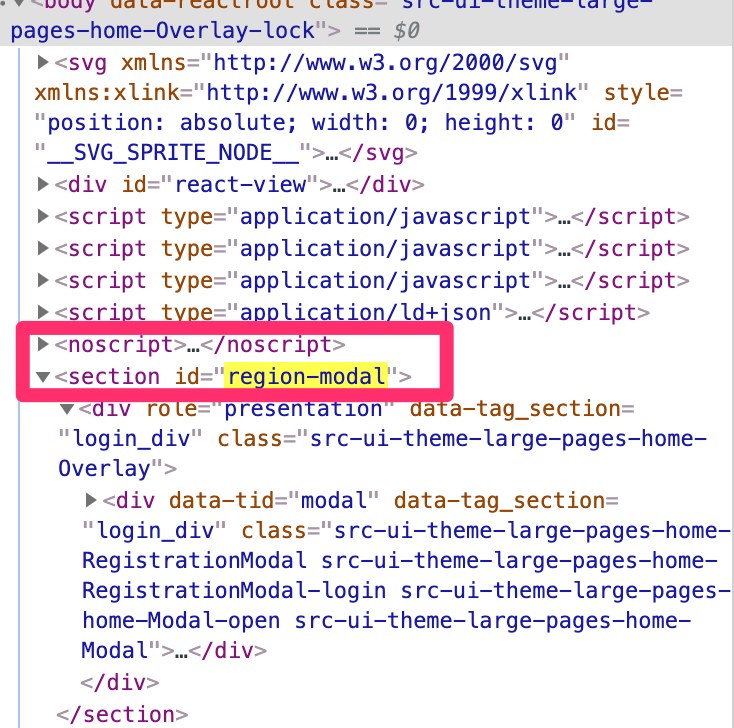
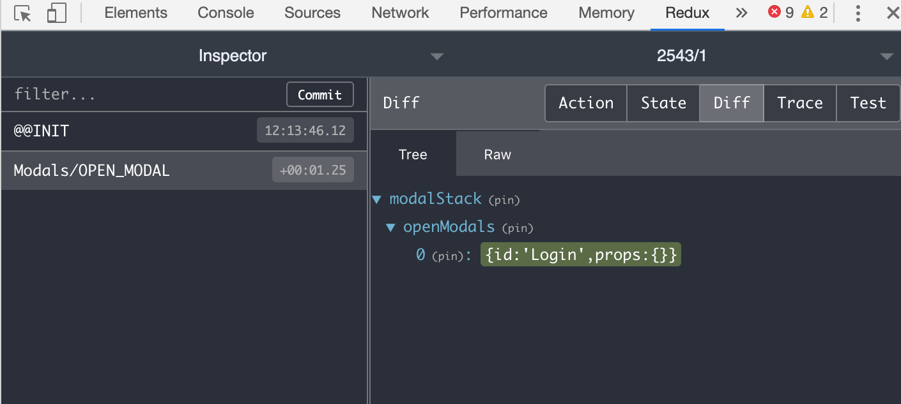

# Using ModalStack

[ModalStack](https://github.com/rentpath/react-ui/blob/master/packages/react-ui-core/src/ModalStack/ModalStack.js) is a generic component designed to empower developers to add modals to our sites easily and consistently. ModalStack loads modal content dynamically, so it does not add to the page weight until the modal appears

At the heart of **ModalStack** is its render() function:


```javascript
  render() {
    const { currentModal } = this.props

    if (currentModal && currentModal.id && this.modalHost) {
      return createPortal(this.renderModals(), this.modalHost)
    }

    this.toggleBodyClass(false)
    return null
  }
```


__There is no need to render your Modal into the DOM.__ ModalStack uses the React [createPortal](https://reactjs.org/docs/react-dom.html#createportal) function to render children into a specific DOM node (`modalHost)`. The modalHost node has the default id **region-modal**; it is created on demand and appended to the document body.[^1] When a Modal is opened and closed, it is appended to and removed from the `modalHost` node. The currentModal prop is used to keep track of the currently open Modal.

When a Modal is open, ModalStack calls `toggleBodyClass` to add an “`Overlay-lock`” class to the document body. Calling `toggleBodyClass(false) `removes the “`Overlay-lock`” class. This can be used to hide or show other elements, e.g. when the LocationModal is open, we hide the location search results in the header.




## Steps to adding a new Modal:


### 1. Add a new entry to the config object

In rent-js this lives in src/ui/large|small/config/modalConfig.js. In AG, it’s in src/apps/large|small/modalConfig.js. Rent’s modal config looks like so:

```javascript
export const modalDefinitions = {
  [LEAD_MODAL_ID]: {
    name: 'LeadModal',
    resolve: () => import('ui/large/components/LeadModal'),
    overlay: true,
  },
  [THANK_YOU_MODAL_ID]: {
    name: 'ThankYouModal',
    resolve: () => import('ui/large/components/ThankYouModal'),
    overlay: true,
  },
// ...
```


The config keys are unique strings defined in a constants file. The **name** is used to automatically generate webpack chunks for each modal, so each modal’s code is lazily-loaded. The **resolve** key contains a function that loads the modal by **import**ing the corresponding component, and **overlay** controls whether the modal is wrapped by an overlay div or not. The overlay provides a background layer with a click handler that closes the modal.

All of the modals in the config are passed to a **ModalStack** instance in the Layout of the application/view. For example, in rent-js’ large Layout.js, we have:


```javascript
import { modalDefinitions } from 'ui/large/config/modalConfig'

//...  

return (
    <div className={combinedClassOuter}>
      <ModalStack modalDefinitions={modalDefinitions} />
      {HeaderComponent && <HeaderComponent />}
      <section className={theme.Layout_Container}>
        {children}
      </section>
    </div>
  )
```


### 2. Define open and close functions (rent.js only)

In rent.js these live in src/app/store/shared/actions/modal.js. Each modal has a set of named functions, e.g. openSignInModal, closeSignInModal, openFiltersModal, closeFiltersModal, etc. These actions just pass the modal ID to openModal and closeModal. In ag.js, we just use the openModal and closeModal functions and pass in the desired modal ID.

These actions trigger changes to the “modal” (or “modalStack” in the case of ag) slice of the redux state, modifying the openModals list:





In both rent.js and ag.js, ModalStack is connected to redux using the following container:


```javascript
import { connect } from 'react-redux'
import { currentModal as currentModalSelector } from 'app/selectors/modal'
import { closeModal } from 'app/store/shared/actions'
import { ModalStack } from '@rentpath/react-ui-core'

const mapStateToProps = state => ({
  currentModal: currentModalSelector(state),
})

const mapDispatchToProps = {
  onClose: closeModal,
}

export default connect(mapStateToProps, mapDispatchToProps)(ModalStack)
```


Note that even though we’re passing in the `closeModal` function to ModalStack here, you still have to pass a `closeModal` function to your Modal.

ModalStack also supports “stacked” modals. When multiple stacked modals are opened, the topmost modal will display. When it is closed, the next modal down the stack will open, and so on until there are no more modals in the stack. Use the `openStackedModal` action in both ag.js and rent.js if you need this functionality.


### 3. Create a wrapper component for your Modal. 

Your component path must match used by the <code>import</code> statement in the <code>resolve</code> attribute of the modal config created in step 1.

The wrapper can be a normal React Component or PureComponent that renders a <code>react-ui-core Modal.</code>

Here is a simple example:


```javascript
import { Modal } from '@rentpath/react-ui-core'
// …

export default class MyModal extends PureComponent {
  render() {
    const {
      onClose,
      isOpen,
    } = this.props

    return (
      <Modal
        className={theme.LocationModal}
        data-tid="location-input-modal"
        CloseButton={{
          children: <Icon className={theme.LocationModal_CloseButton} svgs={{ close }} />
        }}
        onClose={onClose}
        isOpen={isOpen}
      >
      // … your components go here
      </Modal>
    )
  }
```


Let’s examine each of the props being passed to the **Modal** here:

`className`: provides the top-level class used to style the modal

`data-tid`: used by our end-to-end tests to identify the modal. Technically this is not needed because the Modal component has a default data-tid=”modal”.

`CloseButton:` an object or function that generates a close button element. You only need to worry about the display element; the `onClose` function is connected for you. It is your responsibility to provide this data to the Modal; by default, it renders nothing.

`onClose: `You need to pass in the appropriate close action for your Modal, even though ModalStack has a default function.

`isOpen: `This is needed in most cases to make the Modal open. You don’t need to connect it to anything, just include it here.


<!-- Footnotes themselves at the bottom. -->
## Notes

[^1]:
     It's important for the modal to be outside the normal app HTML so it can float above all other content. Refer to [z-index stacking context](https://developer.mozilla.org/en-US/docs/Web/CSS/CSS_Positioning/Understanding_z_index/The_stacking_context) for more info.